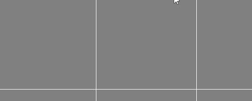

# HooverCoverageSimulator

A Python project using Tkinter to divide a canvas into grid cells and track mouse movement across pixels to estimate cell coverage.  
Built to learn more about coordinate systems and 2D data structures.

## Why Hoover Coverage?

From my current role as a cleaner, I noted some minor inefficiencies when hoovering:

1. As it is a daily task, there is often no clear visual indicator of which areas have already been covered and which have not. This is particularly noticeable in large open spaces where there is little present to break up the room.

2. Task interruptions, such as stopping to help someone else, are fairly common. Upon returning, it can be difficult to determine where prior coverage ended, which can lead to areas being missed or gone over more than once in the same day.

3. In addition to efficiency, the project also explores the idea of visual progress feedback. For repetitive tasks, having a clear sense of progression and completion can make work feel more engaging and rewarding.

## How it Works

The canvas is divided into a grid made up of equally sized square cells.

Each cell represents a small section of the room. Internally, each cell stores a 2D list of boolean values, where each value represents whether a pixel in that cell has been touched or not.

Mouse movement is used to simulate the hoover moving across the floor. As the mouse moves, lines are drawn on the canvas to represent coverage.

## Future Work

- Record which pixels in the current cell have been covered by updating their boolean value.
- Map the mouse position to the correct cell and pixel within the 2D data structure.
- Track how many pixels in a cell have been covered and estimate overall cell completion.
- Use this information to visually change a cell’s colour as coverage increases.

## What I Learned

- How to work with coordinates on a canvas and convert mouse positions into grid and cell locations
- How to use nested lists to store and update information about a grid
- How event handling works in Tkinter, particularly for tracking mouse movement
- How to take a real-world problem and simplify it into something that can be represented in code

